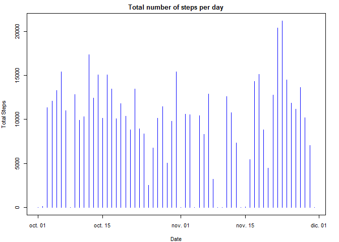
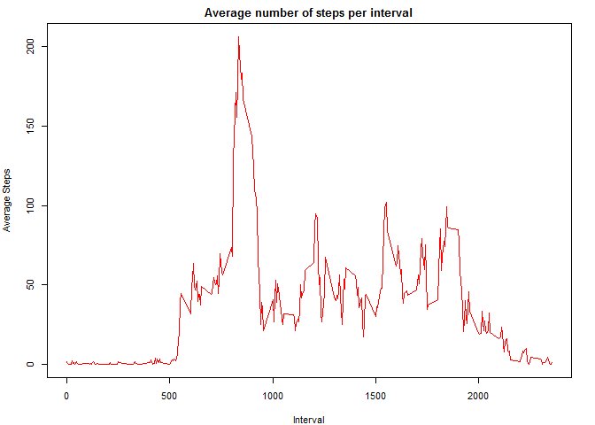
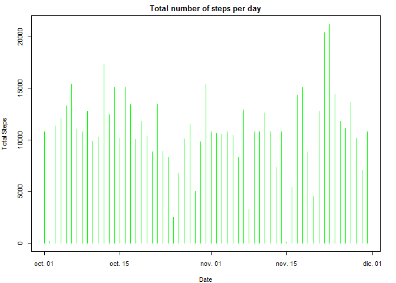
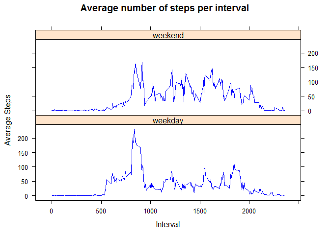

# Reproducible Research: Peer Assessment 1


## Loading and preprocessing the data

1. Load the data (i.e. read.csv())
2. Process/transform the data (if necessary) into a format suitable for your
analysis


In the following steps we are going to load the 2 months data of person activity 
monitoring from an anonymous individual.

I will show the variable names and the structure of the data frame. Also I will
create a vector with the dates from the loaded data for later use.


```r
activityData <- read.csv(file = "activity.csv", header = TRUE)
days <- c(levels(activityData$date))
activityData$date <- as.Date(activityData$date)
names(activityData)
```

```
## [1] "steps"    "date"     "interval"
```

```r
str(activityData)
```

```
## 'data.frame':	17568 obs. of  3 variables:
##  $ steps   : int  NA NA NA NA NA NA NA NA NA NA ...
##  $ date    : Date, format: "2012-10-01" "2012-10-01" ...
##  $ interval: int  0 5 10 15 20 25 30 35 40 45 ...
```


## What is mean total number of steps taken per day?

For this part of the assignment, you can ignore the missing values in the dataset.

1. Make a histogram of the total number of steps taken each day


```r
daySteps <- aggregate(x = activityData$steps, by = list(activityData$date), FUN = sum, na.rm = TRUE)

names(daySteps) <- c("Date", "TotalSteps")

par(mar = c(4, 4, 2, 2), cex = 0.7)

plot(daySteps$Date, daySteps$TotalSteps, xlab = "Date", ylab = "Total Steps", col = "blue",  main = "Total number of steps per day", type = "h")
```

 


2. Calculate and report the mean and median total number of steps taken
per day


Calculating the mean:


```r
meanTotalSteps <- mean(daySteps$TotalSteps, na.rm = TRUE)
meanTotalSteps
```

```
## [1] 9354.23
```

Calculating the median:


```r
medianTotalSteps <- median(daySteps$TotalSteps, na.rm = TRUE)
medianTotalSteps
```

```
## [1] 10395
```


## What is the average daily activity pattern?

1. Make a time series plot (i.e. type = "l") of the 5-minute interval (x-axis)
and the average number of steps taken, averaged across all days (y-axis)


```r
intervalSteps <- aggregate(x = activityData$steps, by = list(activityData$interval), FUN = mean, na.rm = TRUE)
names(intervalSteps) <- c("Interval", "AverageSteps")

par(mar = c(4, 4, 2, 2), cex = 0.7)

plot(intervalSteps$Interval, intervalSteps$AverageSteps, xlab = "Interval", ylab = "Average Steps", col = "red",  main = "Average number of steps per interval", type = "l")
```

 


2. Which 5-minute interval, on average across all the days in the dataset,
contains the maximum number of steps?


```r
rowMaxIntSteps <- 0

for(i in 1:288){
    
    if(intervalSteps[i, 2] == max(intervalSteps$AverageSteps)){
        rowMaxIntSteps <- i
        return
    }        
}

intervalMax <- intervalSteps[rowMaxIntSteps, 1]

intervalMax
```

```
## [1] 835
```

The interval with the maximum number of steps is the 835.


## Imputing missing values

1. Calculate and report the total number of missing values in the dataset
(i.e. the total number of rows with NAs)


```r
isMissing <- is.na(activityData$steps)
numMissing <- sum(isMissing)
numMissing
```

```
## [1] 2304
```

2. Devise a strategy for filling in all of the missing values in the dataset. The
strategy does not need to be sophisticated. For example, you could use
the mean/median for that day, or the mean for that 5-minute interval, etc.

I am going to fill the missing values with the mean of the corresponding 5-minute 
interval.


3. Create a new dataset that is equal to the original dataset but with the
missing data filled in.


```r
filledActivityData <- activityData
filledActivityData$steps <- replace(activityData$steps, list = isMissing, values = intervalSteps$AverageSteps)
str(filledActivityData)
```

```
## 'data.frame':	17568 obs. of  3 variables:
##  $ steps   : num  1.717 0.3396 0.1321 0.1509 0.0755 ...
##  $ date    : Date, format: "2012-10-01" "2012-10-01" ...
##  $ interval: int  0 5 10 15 20 25 30 35 40 45 ...
```

4. Make a histogram of the total number of steps taken each day and Calculate
and report the mean and median total number of steps taken per day. 


Histogram


```r
filledDaySteps <- aggregate(x = filledActivityData$steps, by = list(filledActivityData$date), FUN = sum, na.rm = TRUE)
names(filledDaySteps) <- c("Date", "TotalSteps")

par(mar = c(4, 4, 2, 2), cex = 0.7)

plot(filledDaySteps$Date, filledDaySteps$TotalSteps, xlab = "Date", ylab = "Total Steps", col = "green",  main = "Total number of steps per day", type = "h")
```

 

Calculating the mean:


```r
meanTotalStepsFilled <- mean(filledDaySteps$TotalSteps, na.rm = TRUE)
meanTotalStepsFilled
```

```
## [1] 10766.19
```

Calculating the median:


```r
medianTotalStepsFilled <- median(filledDaySteps$TotalSteps, na.rm = TRUE)
medianTotalStepsFilled
```

```
## [1] 10766.19
```

Do these values differ from the estimates from the first part of the assignment?

Yes, the mean and median differ from the initial values.


What is the impact of imputing missing data on the estimates of the total
daily number of steps?

Calculated values are higher than the initial values because we introduce some 
data higher than 0 and this afects the results obtained. 


## Are there differences in activity patterns between weekdays and weekends?

For this part the weekdays() function may be of some help here. Use the dataset
with the filled-in missing values for this part.

1. Create a new factor variable in the dataset with two levels – “weekday”
and “weekend” indicating whether a given date is a weekday or weekend
day.


```r
Sys.setlocale("LC_TIME", "English")
```

```
## [1] "English_United States.1252"
```

```r
dayOfWeek <- weekdays(filledActivityData$date)

for(i in 1:17568){
    
    if(dayOfWeek[i] == "Saturday" || dayOfWeek[i] == "Sunday"){
        dayOfWeek[i] <- "weekend"
    }
    
    else{
        dayOfWeek[i] <- "weekday"
    }
}

dayOfWeek <- factor(dayOfWeek)

filledActivityData <- cbind(filledActivityData, dayOfWeek)

str(filledActivityData)
```

```
## 'data.frame':	17568 obs. of  4 variables:
##  $ steps    : num  1.717 0.3396 0.1321 0.1509 0.0755 ...
##  $ date     : Date, format: "2012-10-01" "2012-10-01" ...
##  $ interval : int  0 5 10 15 20 25 30 35 40 45 ...
##  $ dayOfWeek: Factor w/ 2 levels "weekday","weekend": 1 1 1 1 1 1 1 1 1 1 ...
```


2. Make a panel plot containing a time series plot (i.e. type = "l") of the
5-minute interval (x-axis) and the average number of steps taken, averaged
across all weekday days or weekend days (y-axis). 


The first step is to create two dataframes containing the average number of steps per interval, one for weekdays and the other for weekends:


```r
weekdayIntervalSteps <- aggregate(x = subset(filledActivityData$steps, filledActivityData$dayOfWeek == "weekday"), by = list(subset(filledActivityData$interval, filledActivityData$dayOfWeek == "weekday")), FUN = mean, na.rm = TRUE)
names(weekdayIntervalSteps) <- c("Interval", "AverageSteps")

weekendIntervalSteps <- aggregate(x = subset(filledActivityData$steps, filledActivityData$dayOfWeek == "weekend"), by = list(subset(filledActivityData$interval, filledActivityData$dayOfWeek == "weekend")), FUN = mean, na.rm = TRUE)
names(weekendIntervalSteps) <- c("Interval", "AverageSteps")
```


Now we create a single dataframe with the information of both previous dataframes and we bind a factor column that specifies whether is a mesure of weekday or weekend:


```r
weekIntervalSteps <- rbind(weekdayIntervalSteps, weekendIntervalSteps) 

dayWeekFactor <- c(rep("weekday", 288), rep("weekend", 288))

dayWeekFactor <- factor(dayWeekFactor)

weekIntervalSteps <- cbind(weekIntervalSteps, dayWeekFactor)

str(weekIntervalSteps)
```

```
## 'data.frame':	576 obs. of  3 variables:
##  $ Interval     : int  0 5 10 15 20 25 30 35 40 45 ...
##  $ AverageSteps : num  2.251 0.445 0.173 0.198 0.099 ...
##  $ dayWeekFactor: Factor w/ 2 levels "weekday","weekend": 1 1 1 1 1 1 1 1 1 1 ...
```


And now, we are ready to plot the data as desired:


```r
library(lattice)
```

```
## Warning: package 'lattice' was built under R version 3.1.3
```

```r
xyplot(weekIntervalSteps$AverageSteps ~ weekIntervalSteps$Interval | weekIntervalSteps$dayWeekFactor, xlab = "Interval", ylab = "Average Steps", col = "blue",  main = "Average number of steps per interval", type = "l", layout = c(1, 2))
```

 

